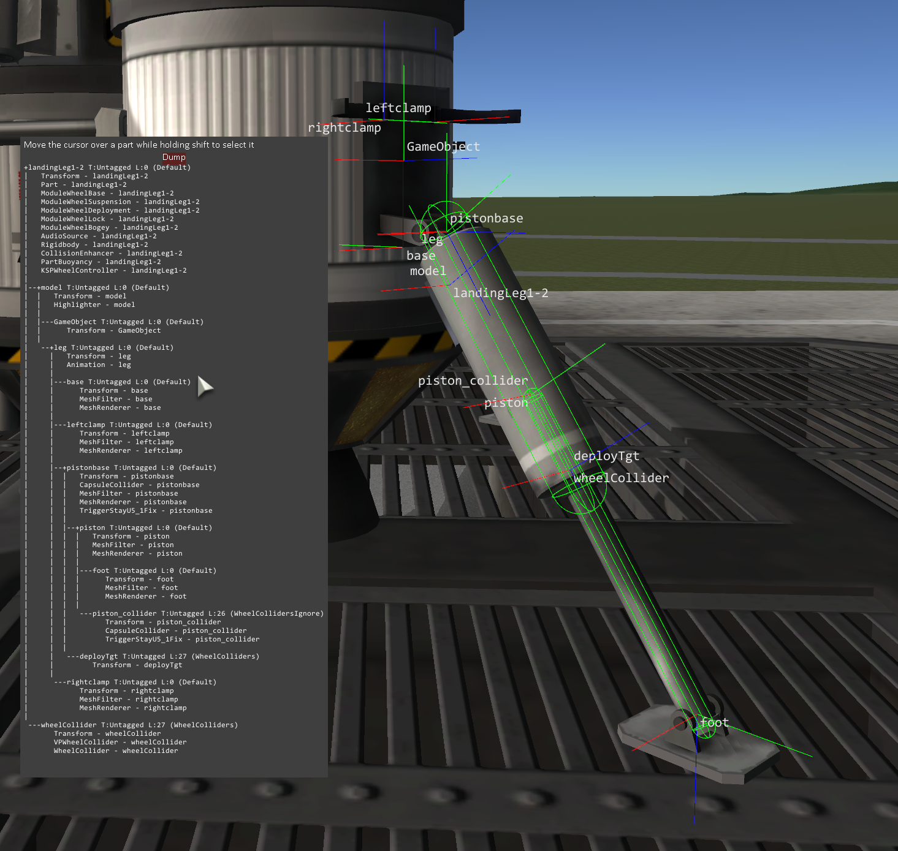
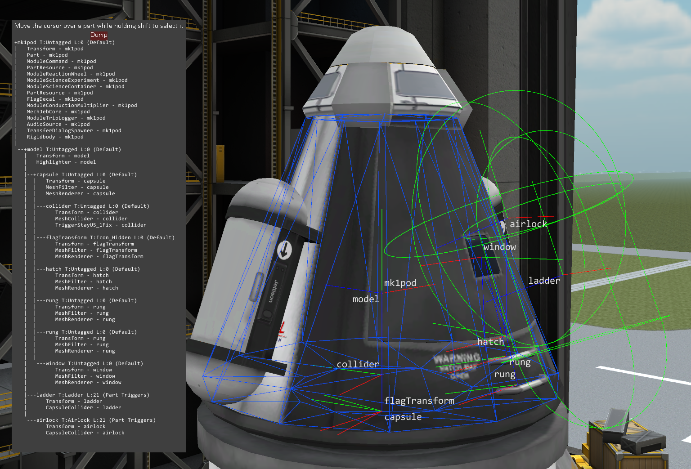
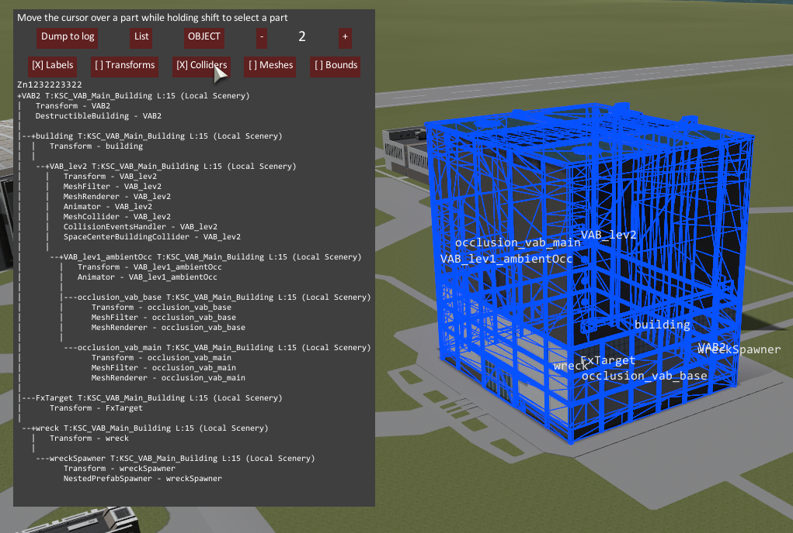
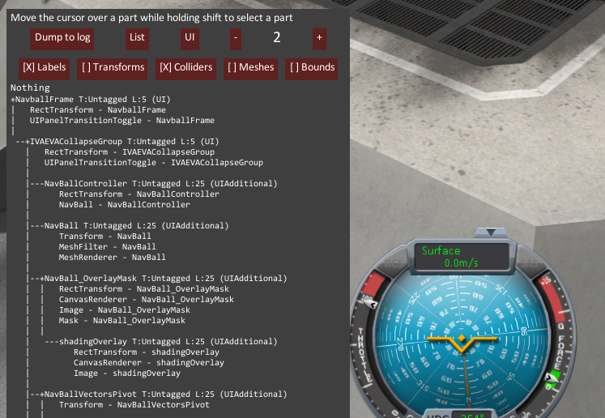

# Debug Stuff /L Unleashed

Debug stuff is a simple plugin that allows you to display the transform & colliders of a part in wireframe and display the part Hierarchy in a window. It was created to help understanding how the new legs work.

[Unleashed](https://ksp.lisias.net/add-ons-unleashed/) fork by Lisias.

## In a Hurry

* [Latest Release](https://github.com/net-lisias-kspu/DebugStuff/releases)
	+ [Binaries](https://github.com/net-lisias-kspu/DebugStuff/tree/Archive)
* [Source](https://github.com/net-lisias-kspu/DebugStuff)
* Documentation
	+ [Project's README](https://github.com/net-lisias-kspu/DebugStuff/blob/master/README.md)
	+ [Install Instructions](https://github.com/net-lisias-kspu/DebugStuff/blob/master/INSTALL.md)
	+ [Change Log](./CHANGE_LOG.md)
	+ [TODO](./TODO.md) list

## Description

Debug stuff is a simple plugin that allows you to display the transform & colliders of a part in wireframe and display the part Hierarchy in a window. It was created to help understanding how the new legs work.

The window is opened with ALT P and you select an Object by holding shift and moving the cursor over your ship. The dump button will save the content of the window to your log. You can change the current mode between PART, UI and OBJECT. Each one will target specific type of object. The -/+ button limit how far up in the object parent the display goes.

## Installation

Detailed installation instructions are now on its own file (see the [In a Hurry](#in-a-hurry) section) and on the distribution file.

## License:

* TweakScale is double licensed as follows:
	+ [SKL 1.0](https://ksp.lisias.net/SKL-1_0.txt). See [here](./LICENSE.SKL-1_0)
		+ You are free to:
			- Use : unpack and use the material in any computer or device
			- Redistribute : redistribute the original package in any medium
		+ Under the following terms:
			- You agree to use the material only on (or to) KSP
			- You don't alter the package in any form or way (but you can embedded it)
			- You don't change the material in any way, and retain any copyright notices
			- You must explicitly state the author's Copyright, as well an Official Site for downloading the original and new versions (the one you used to download is good enough)
	+ [GPL 2.0](https://www.gnu.org/licenses/gpl-2.0.txt). See [here](./LICENSE.GPL-2_0)
		+ You are free to:
			- Use : unpack and use the material in any computer or device
			- Redistribute : redistribute the original package in any medium
			- Adapt : Reuse, modify or incorporate source code into your works (and redistribute it!) 
		+ Under the following terms:
			- You retain any copyright notices
			- You recognise and respect any trademarks
			- You don't impersonate the authors, neither redistribute a derivative that could be misrepresented as theirs.
			- You credit the author and republish the copyright notices on your works where the code is used.
			- You relicense (and fully comply) your works using GPL 2.0
				- Please note that upgrading the license to GPLv3 **IS NOT ALLOWED** for this work, as the author **DID NOT** added the "or (at your option) any later version" on the license. 	
			- You don't mix your work with GPL incompatible works.
	* If by some reason the GPL would be invalid for you, rest assured that you still retain the right to Use the Work under SKL 1.0. 
* Older versions (1.7.0.0 and previous) are still available under MIT.

Please note the copyrights and trademarks in [NOTICE](./NOTICE).

## UPSTREAM

* [sarbian](https://forum.kerbalspaceprogram.com/index.php?/profile/57146-sarbian/) ROOT
	+ [Forum](https://forum.kerbalspaceprogram.com/index.php?/topic/135726-*/)
	+ [Github](https://github.com/sarbian/DebugStuff)
